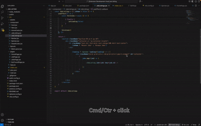

# StyleSense (CSS Navigator)

**Navigate your styles instantly.** Jump directly from any `class` or `id` in your HTML, JS, JSX, Vue, or PHP files to its corresponding CSS definition with a simple **Ctrl+Click**.

[](https://marketplace.visualstudio.com/items?itemName=raredevv.css-navigator)
[](https://marketplace.visualstudio.com/items?itemName=raredevv.css-navigator)
[](https://marketplace.visualstudio.com/items?itemName=raredevv.css-navigator)

---

## ✨ Free Features

### 🎯 **Instant Navigation**
- **Ctrl/Cmd + Click** on any CSS class or ID → jump directly to definition
- **Right-click context menu** with "Go to CSS Definition" option
- **Real-time status bar** showing search progress and results

### 🛠 **Multi-Framework Support**
- **React/JSX**: `className="header-nav"` ← Works perfectly
- **Vue.js**: `:class="'nav-item'"` ← Vue binding support  
- **Angular**: `[class]="'sidebar'"` ← Angular bindings
- **HTML/PHP**: `class="content"` ← Standard support

### 📂 **Smart File Detection**
- Automatically finds linked CSS files (`<link href="...">`)
- Detects CSS imports (`import './style.css'`)
- Searches inline `<style>` tags
- Configurable search paths for build directories

---

## 🚀 StyleSense Pro (Premium)

Unlock advanced productivity features:

### 🎯 **Advanced Navigation**
- **Multi-file QuickPick** - Choose from multiple matches with code previews
- **CSS Variable Navigation** - Jump to `var(--primary-color)` definitions  
- **SCSS/SASS Mixins** - Navigate to `@mixin` and `@function` definitions
- **Hover Previews** - See styles without leaving your file

### ⚡ **Performance & Scale**
- **Optimized Indexing** - Lightning fast search in large projects
- **Multi-root Workspace** - Perfect for monorepos and micro-frontends
- **Smart Caching** - Reduces search time by 70%

### 🎨 **Framework Intelligence**  
- **Tailwind CSS Integration** - Jump to docs or config instead of CSS
- **CSS-in-JS Navigation** - Styled-components and emotion support
- **Bootstrap/Framework Detection** - Smart handling of utility classes

### 👥 **Team Features**
- **Workspace Configuration** - Share team settings and search rules
- **Custom Search Patterns** - Define project-specific CSS locations
- **Priority Support** - Direct access for bug reports and feature requests

**[Get StyleSense Pro →](https://gumroad.com/l/stylesense-pro)**

---

## ⚡ Quick Start

### Installation
1. Install from [VS Code Marketplace](https://marketplace.visualstudio.com/items?itemName=raredevv.css-navigator)
2. **Ctrl+Click** any CSS class or ID
3. Jump instantly to its definition 🎉

### Basic Usage
```html
<!-- Ctrl+Click on any class -->
<div class="header-nav">...</div>
<div id="main-content">...</div>
```

```jsx  
// Works in React too
<button className="btn-primary">Click me</button>
```

---

## ⚙️ Configuration

```jsonc
{
  "goToStyle.enabled": true,
  "goToStyle.debug": false, 
  "goToStyle.searchInNodeModules": false,
  "goToStyle.additionalSearchPaths": [
    "**/dist/**/*.css",
    "**/build/**/*.css"
  ],
  "goToStyle.maxSearchResults": 100
}
```

---

## 📊 Demo



*Jump from HTML to CSS instantly with Ctrl+Click*

---

## 💖 Support This Project

StyleSense is developed by an independent developer. Your support helps fund new features and improvements!

### 🎯 Ways to Support:

[](https://github.com/sponsors/raredevv)
[](https://buymeacoffee.com/raredevv)
[](https://paypal.me/raredevv)

### 🚀 Premium License
**[Get StyleSense Pro](https://gumroad.com/l/stylesense-pro)** - Unlock all advanced features + support development

### 📧 Contact
- **Email**: devpromise234@gmail.com
- **GitHub**: [@raredevv](https://github.com/raredevv)
- **Issues**: [Report bugs or request features](https://github.com/raredevv/css-navigator-public/issues)

---

## 🎯 Why StyleSense?

| Problem | Before StyleSense | With StyleSense |
|---------|------------------|-----------------|
| Finding CSS class | Manual search across files | **Ctrl+Click** |
| Multiple CSS files | Hunt through each one | **QuickPick menu** (Pro) |
| Large projects | Slow, manual process | **Instant navigation** |
| Framework complexity | Different syntax confusion | **Auto-detection** |

**Stop hunting for CSS. Start navigating instantly.**

---

## 📈 Roadmap

- [ ] CSS-in-JS full support (styled-components, emotion)
- [ ] Tailwind CSS documentation links  
- [ ] SCSS/SASS variable navigation
- [ ] Live style preview on hover
- [ ] Workspace-wide CSS class search
- [ ] Team collaboration features

---

## 🤝 Contributing

Love StyleSense? Here's how you can help:

1. **⭐ Star this repo** - Show your support
2. **🐛 Report bugs** - Help us improve
3. **💡 Suggest features** - Shape the roadmap  
4. **💰 Sponsor development** - Fund new features
5. **📢 Spread the word** - Tell other developers

---

## 📄 License

**StyleSense Core (Free)**: MIT License  
**StyleSense Pro (Premium)**: Commercial License

---

<div align="center">

**Made with ❤️ by [RareDevv](https://github.com/raredevv)**

*Transform your CSS workflow from manual hunting to instant navigation*

[](https://github.com/sponsors/raredevv)

</div>